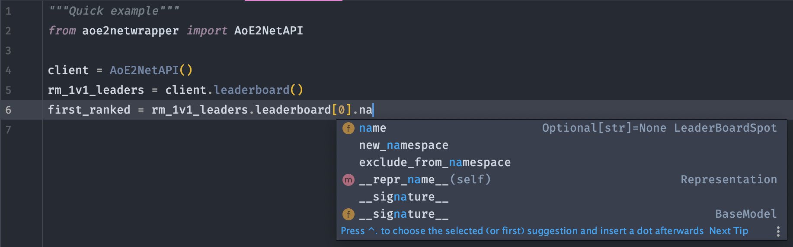

# Features

## Simple and Fully Typed

The packages clients' methods mirror the `aoe2.net` endpoints, making the api objects easy and intuitive to use.
They also come with sensible defaults everywhere possible.

All of `aoe2netwrapper` is type hinted, providing autocompletion and return insights everywhere.
No typing the wrong key names, coming back and forth between docs, or scrolling up and down to find if you need `matchid` or `match_id`.

## Validated Response Models

The models used in `aoe2netwrapper` encapsulate and enhance the data returned by the `aoe2.net` APIs:
* No mess of confusing nested standard types: the methods all return tailored models encapsulating the returned data, recursively.
* No surprises: Data returned from the API is parsed and validated before being given back to you as custom models.
* Convenience: all models returned by the clients provide auto-completion on attributes, recursively.

As for example below, the `profile_id` key inside a `LeaderBoardSpot` inside a `LeaderBoardResponse` that come from the `https://aoe2.net/api/leaderboard` endpoint.

All the validation is handled by the well-established and robust [pydantic][pydantic_repo]{target=_blank}.

??? tip "Models Integration"
    All the other goodies from the returned pydantic models are available to you: exporting options, deep copies, ORM integration, etc.

## Built-In Results Conversion to Pandas DataFrames

Installing the package with the `dataframe` extra gives access to the `converters` submodule, providing a high-level class to export results to `pandas` DataFrames.
The class, `Convert`, provides static methods taking in the direct output given by the `AoENetAPI`'s query methods, and named after them.

## Logging & Testing

* 100% test coverage.
* A codebase making use of the amazing logging from [loguru][loguru_repo]{target=_blank}, which can be integrated and extended.

[pydantic_repo]: https://github.com/samuelcolvin/pydantic
[loguru_repo]: https://github.com/delgan/loguru